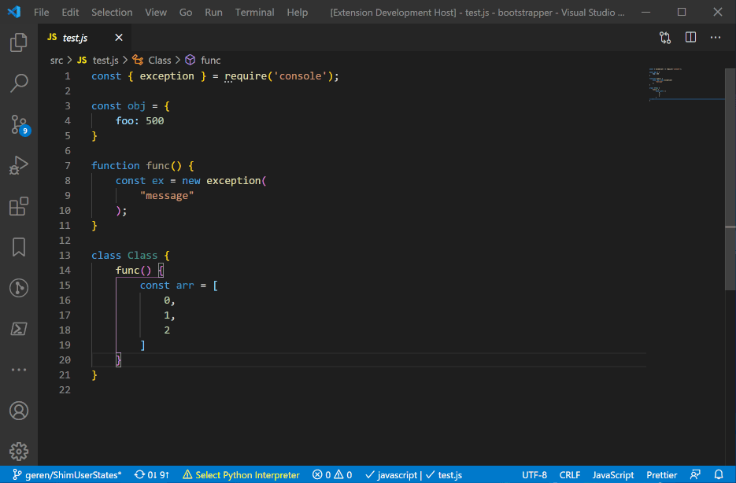
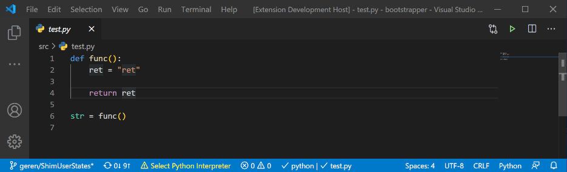
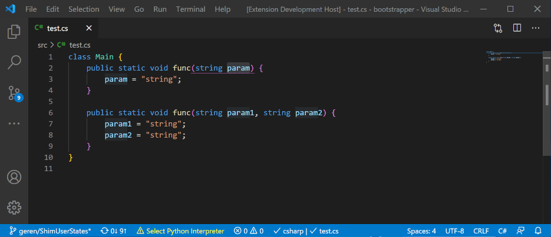
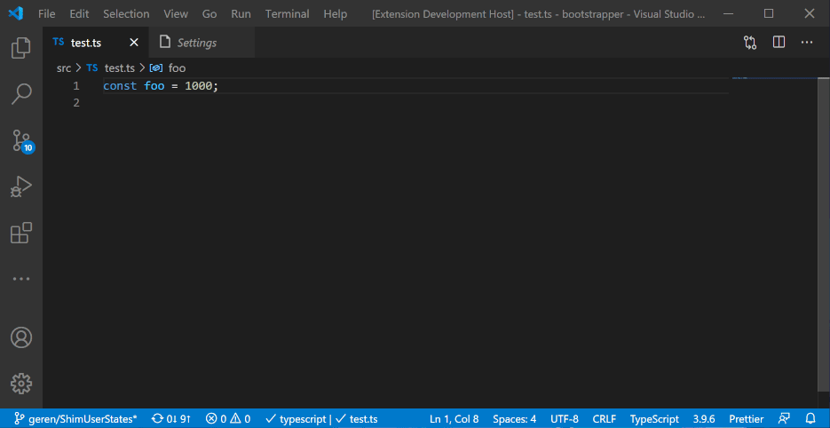
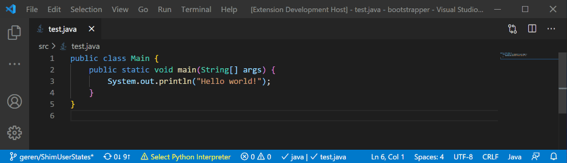
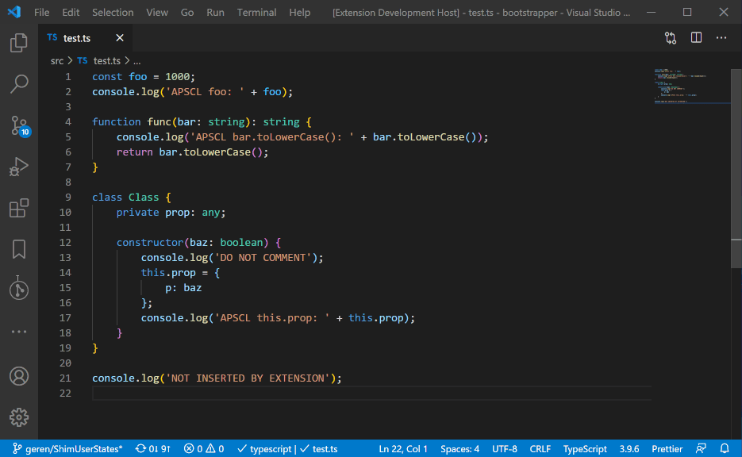
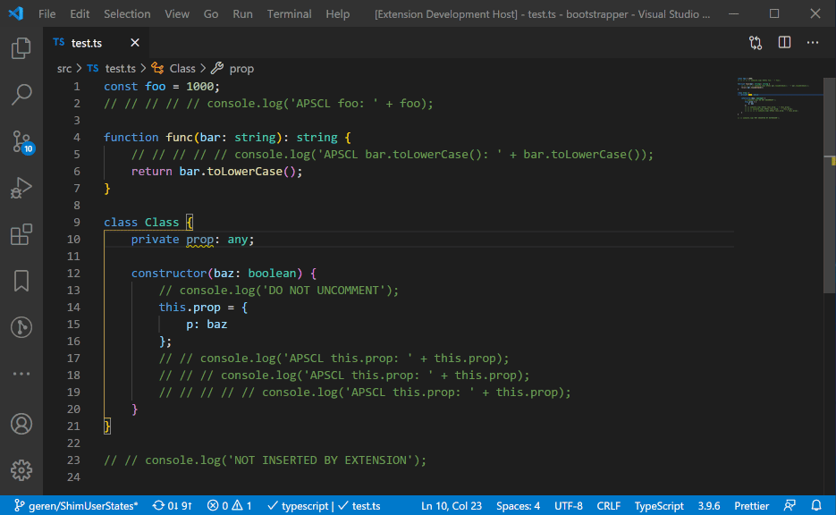
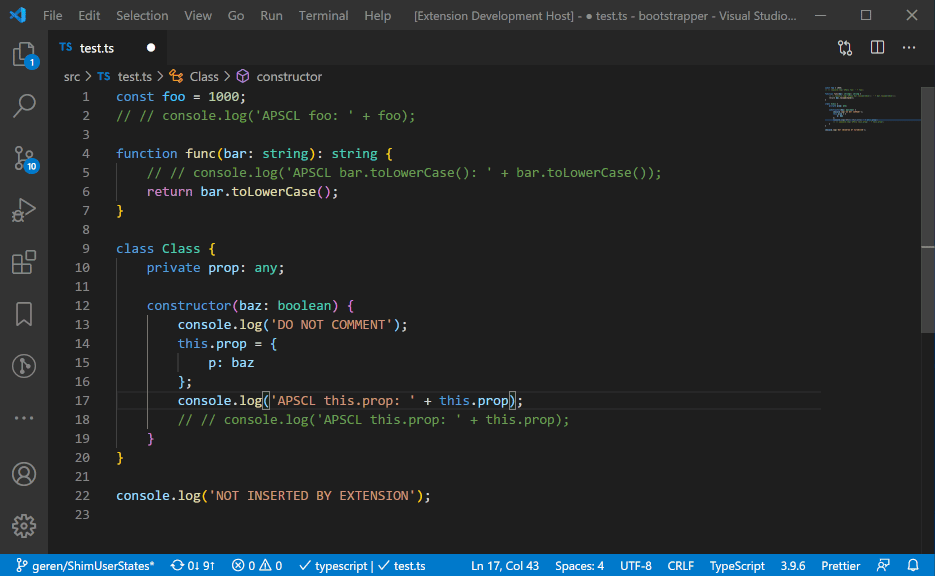
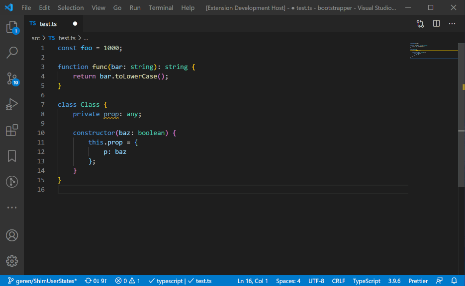
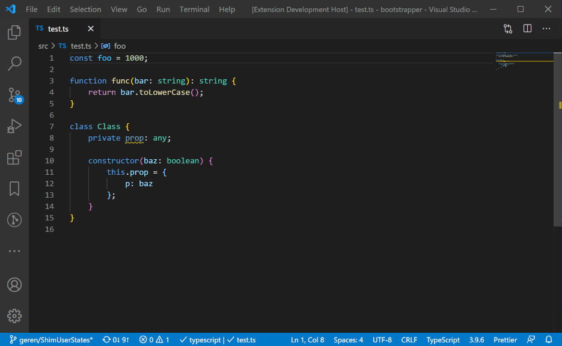

# Supersonic Debug Log README

This extension simplifies debugging with logs by automating the creation of logs.

This extension was inspired by the other similar extensions. Personally, I found that no one existing logging extension contained the complete feature set I wanted. At best, the features I wanted were split between at least three other extensions. So I wrote my own extension. The hope is that this is the logging extension with the most complete feature set.

## TLDR

- Default supported languages: C++, C#, Go, Java, Javascript, Typescript, Python, r, Ruby, Swift.
  - If you want a different language or want to change the log structure of a default language, use the [supersonicDebugLog.languageSettings](#supersonicDebugLog.languageSettings) setting.
- Either highlight text or place the cursor on the text to use
- Insert log the line above: `shift + alt + q` or Command Palette `Supersonic Debug Log: Insert Log Message`
- Insert log the line below: `shift + alt + e` or Command Palette `Supersonic Debug Log: Insert Log Message Directly Below`
- Insert log below a block below: `shift + alt + w` or Command Palette `Supersonic Debug Log: Insert Log Message Directly Above`
- Comment all logs inserted by the extension: `shift + alt + c` or Command Palette `Supersonic Debug Log: Comment All Log Messages`
- Uncomment all logs inserted by the extension: `ctrl/cmd + shift + alt + c` or Command Palette `Supersonic Debug Log: Uncomment All Log Messages`
- Delete all logs inserted by the extension: `shift + alt + d` or Command Palette `Supersonic Debug Log: Delete All Log Messages`

## Features

### Multi language support

#### Default support for 10 popular languages

By default, this extension supports the following languages:

- C++
- C#
- Go
- Java
- Javascript
- Typescript
- Python
- r
- Ruby
- Swift

If your language is not currently supported by default, by using the [supersonicDebugLog.languageSettings](#supersonicDebugLog.languageSettings) setting, you can add support for any language you require.

#### Highlight specific text or use the auto text select

If you have text highlighted, the extension will log the highlighted text. Else if your cursor is placed on some text, the extension will log the text your cursor is on. Otherwise, a [snippet](#includes-snippet-support) will be inserted.

#### Insert log messages after a block

Shortcut: `shift + alt + w`

Command Palette: `Supersonic Debug Log: Insert Log Message`

A block is defined as anything enclosed by `<`, `(`, `[`, or `{` characters.



#### Insert log messages above

Shortcut: `shift + alt + q`

Command Palette: `Supersonic Debug Log: Insert Log Message Directly Above`



#### Insert log messages below

Shortcut: `shift + alt + e`

Command Palette: `Supersonic Debug Log: Insert Log Message Directly Below`



### Easily insert labelled log messages

The label structure can be changed using the [supersonicDebugLog.label](#supersonicDebugLog.label) setting.



### Includes snippet support

A snippet is a blank log. These are language specific and can be changed using the [supersonicDebugLog.languageSettings](#supersonicDebugLog.languageSettings) setting. To insert a snippet, use one of the `Insert` commands with no text selected. The cursor must not be touching any text.



### Modify all logs inserted by the extension

#### Comment all logs inserted by the extension

Shortcut: `shift + alt + c`

Command Palette: `Supersonic Debug Log: Comment All Log Messages`



#### Uncomment all logs inserted by the extension

Shortcut: `ctrl/cmd + shift + alt + c`

Command Palette: `Supersonic Debug Log: Uncomment All Log Messages`



#### Delete all logs inserted by the extension

Shortcut: `shift + alt + d`

Command Palette: `Supersonic Debug Log: Delete All Log Messages`



### Multiple cursor support



### Wrapped log messages

Turn on/off wrapped log messages with the [supersonicDebugLog.wrapLogMessage](#supersonicDebugLog.wrapLogMessage) setting.

The wrapped log message format is language specific and can be changed using the [supersonicDebugLog.languageSettings](#supersonicDebugLog.languageSettings) setting.



## Extension Settings

This extension contributes the following settings:

### `supersonicDebugLog.label`

What the label part of the log looks like.

- Use `TEXT` to describe where the extension will insert the name of the variable to be logged.
- Where the label is placed in the log can be controlled with `supersonicDebugLog.languageSettings`.

### `supersonicDebugLog.wrapLogMessage`

Whether the log message should be wrapped with other logs.

- The wrapped log structure can be defined with `supersonicDebugLog.languageSettings`.

### `supersonicDebugLog.defaultLanguageSettings`

The default language setting if the current language does not exist in `supersonicDebugLog.languageSettings`.

- This has nearly the same structure as an individual language setting in the [supersonicDebugLog.languageSettings](#supersonicDebugLog.languageSettings) setting.
  - The only difference is that the `fileExtension` property is not needed.
- Arbitrarily by default, this comes as the same language setting as js/ts.

### `supersonicDebugLog.languageSettings`

Describes the format of the logs in different programming languages.

An array of objects. Each object takes the following form (using the js setting as an example):

```json
{
  "commentSymbol": "//",
  "fileExtension": "js",
  "logFormat": "console.log('LABEL' + TEXT);",
  "defaultLogFormat": "console.log();",
  "wrappedLogFormat": "console.log('~~~~~~ SDL ~~~~~~');"
}
```

- `commentSymbol`: Describes what should be used as the comment symbol for that language. 
  - In the example, `//` will be inserted before a line to comment it.
- `fileExtension`: Describes what language this setting applies to.
  - The example will apply to all files with a `js` (javascript) extension. So to any files with the format `file.js`.
- `logFormat`: Describes the format of a normal inserted log.
  - Use `LABEL` to describe where the extension will insert the descriptor label. The descriptor label is defined with [supersonicDebugLog.label](#supersonicDebugLog.label)
  - Use `TEXT` to describe where the extension will insert the variable to be logged.
  - Using the example and the default [supersonicDebugLog.label](#supersonicDebugLog.label), if `test` is selected, then `console.log('SDL test: ' + test);` is inserted.
- `defaultLogFormat`: Describes the format a snippet takes.
  - Using the example, if a snippet is inserted, then `console.log();` will be inserted.
- `wrappedLogFormat`: Describes the format of the wrapped logs.
  - Using the example, if a wrapped log is inserted, then `console.log('~~~~~~ SDL ~~~~~~');` will be inserted above and below the log.

## Release Notes

### 1.0.0

Initial release of supersonicdebuglog
